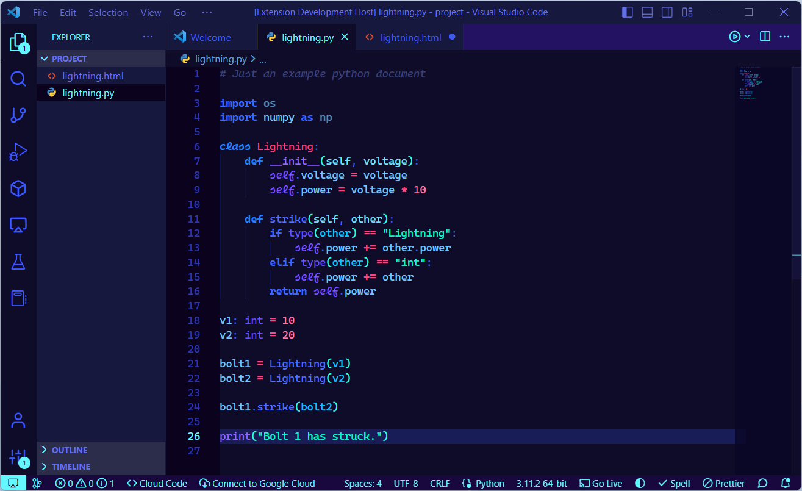
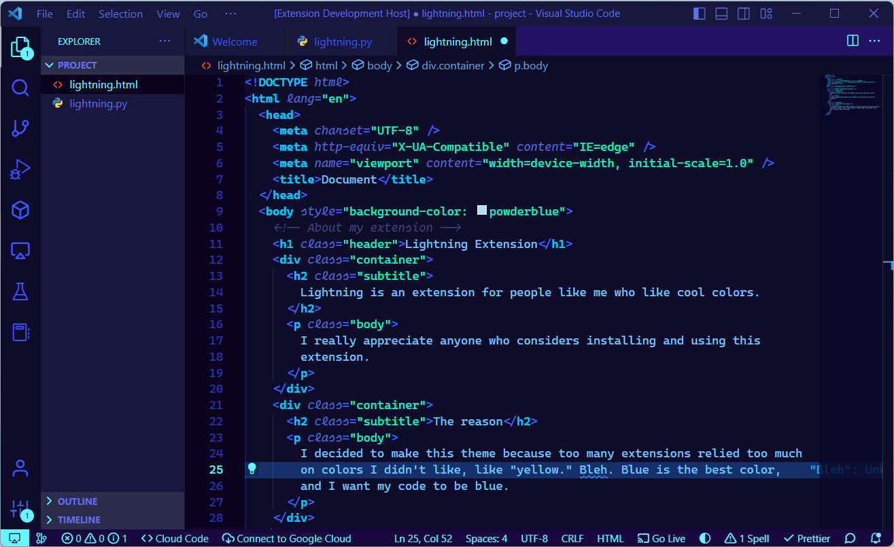

<!-- README for Lightning -->

# Lightning Theme

A dark, vibrant theme for those who enjoy cool colors.

## About

Take a minute to think about the first time you thought coding looked fun. Was it because you had a strong desire to create some software that would change the world? Was it because the sheer thought of challenging yourself and solving problems excited you? Wrong! It was because you saw someone coding in an IDE and thought the pretty colors looked really cool and made what they're doing look more hackery and important.

However, color themes nowadays are focused on boring stuff like "readability" or "productivity" or "minimum eye strain." Um, what? I don't care about that. I want something that looks fun. And let's be honest, nobody ever picks a theme because of its "increased productivity" anyway.

I developed Lightning to be a fun theme! A theme with more good colors (like blue) and less dumb colors like "orange" or "yellow." Will this theme increase your productivity? No. Will it be easy to read? No. Will it be easy on the eyes? No. But will it make coding more fun? Hell yeah.

## Installation
